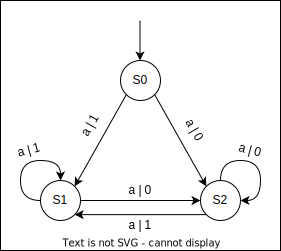

# Домашнее задание по дисциплине "Прикладная теория цифровых автоматов". МГТУ им. Н.Э.Баумана, 2 курс
## Задание
Игра с двумя монетами, каждую из которых подбрасывает один из двух
игроков. Если выпали два «орла» или две «решки», то выигрывает первый игрок, если
нет – второй. Количество партий фиксировано. Один из игроков – автомат.

